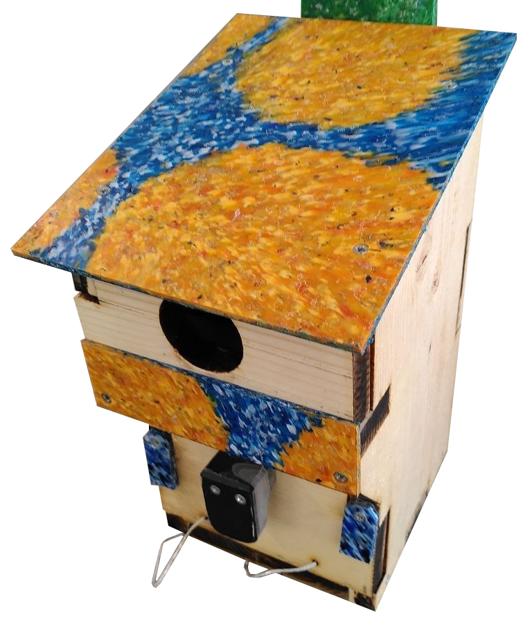
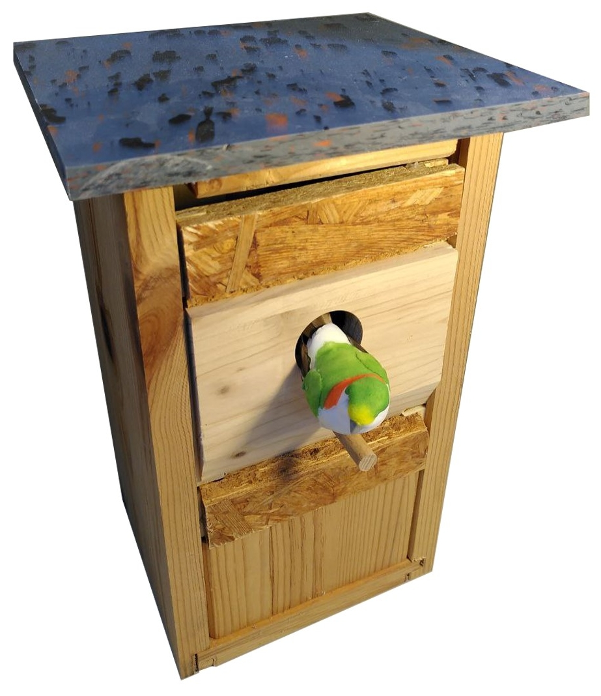
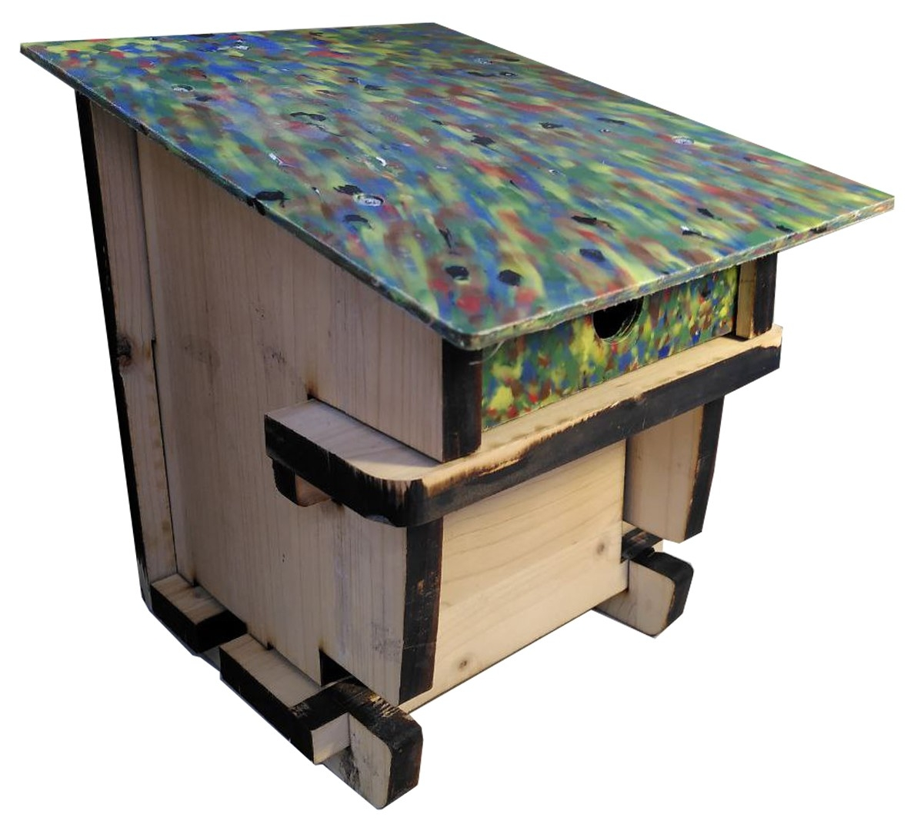
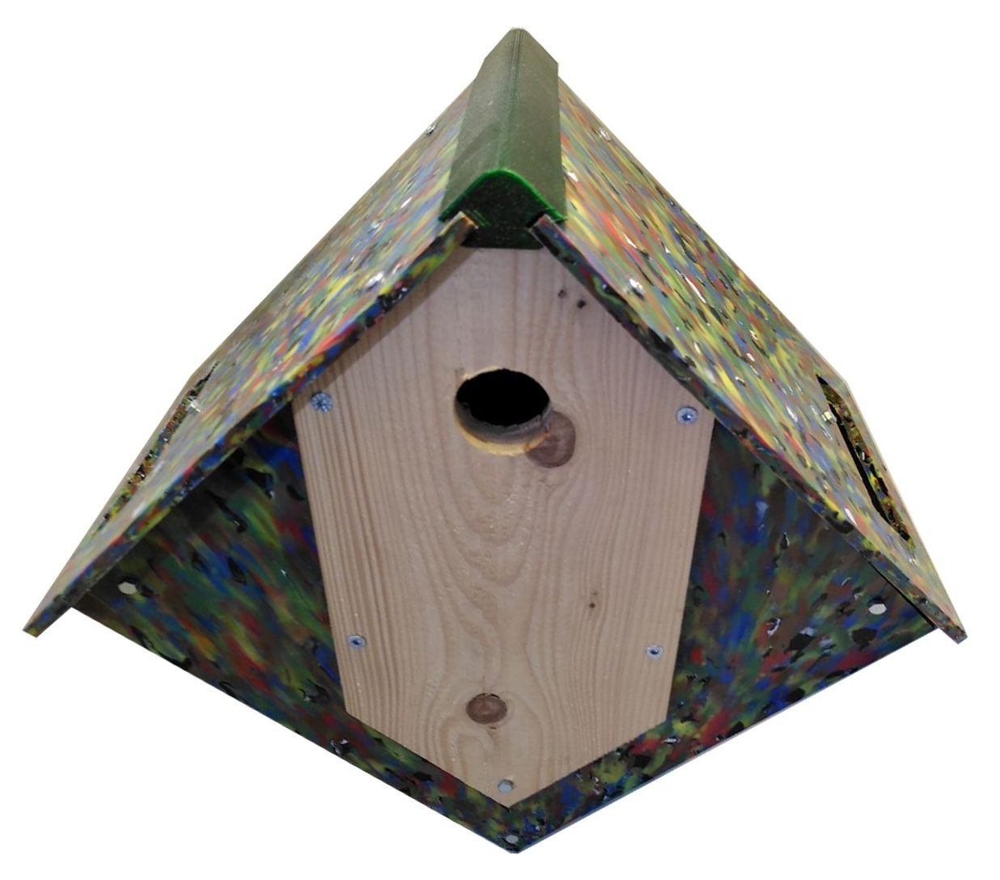

# Vogelnistkästen aus Recyclingplastik und Holz zum Nachbauen

Im Rahmen eines Projekts bei der Offenen-Recycling-Werkstatt (beim insel e.V.) in Hamburg https://werkstatt.insel-ev.de/ wurden verschiedene Vogelnistkästen entwickelt. Die "Deutsche Stiftung für Engagement und Ehrenamt" hat das Projekt gefördert. Projektzeitraum war von November 2023 bis Dezember 2024.

Die Nistkästen sind für verschiedene Höhlenbrüter-Vogelarten geeignet.

## Modelle

Folgende Modelle sind im Laufe des Projekts entstanden (für weitere Informationen, Bauanleitungen usw. auf die jeweiligen Links klicken):

 <table>
  <tr>
    <td>  </td>
    <td>
        <b>Bauworkshop-Nistkasten</b>   
        Dieser Nistkasten eignet sich durch seine einfache Montage besonders gut für Bauworkshops - z.B. mit Grundschulkindern, Jugendlichen oder Erwachsenen. Der Grundkörper besteht aus Holz, ist atmungsaktiv und bietet ein gutes Raumklima für die Vögel. Das Dach und einige andere Elemente bestehen aus Recyclingkunststoff. Die vorstehende Stufe am Einflugloch dient als effektiver Schutz vor Nesträubern wie Katzen, Mardern oder Waschbären.   
        <a href="https://github.com/Recycling-Werkstatt-insel-eV/Nistkasten_1_Oskar">-> Zur Bauanleitung und Dokumentation</a>
    </td>
  </tr>
</table>

 <table>
  <tr>
    <td>  </td>
    <td>
        <b>Nistkasten "Ivonne"</b>   
        Bei diesem Vogelhaus bestehen sind alle Materialien entweder wiederverwendbar oder wiederaufbereitet und somit auf jeden Fall nachhaltig und umweltfreundlich. Die Vorderseite ist so konstruiert, dass jede Behausung ein Unikat wird. Die einzelnen Platten sind verschieblich. Das und die Tatsache, dass alle Komponenten verschraubt sind, macht es komplett auseinandernehmbar. Teile können somit leicht ersetzt, ausgetauscht und gereinigt werden. Je nach Vogelart, ob Höhlen- oder Halbhöhlenbrüter kann die Öffnung der Vogelart angepasst werden. Die Kombination aus recyceltem Kunstoff und Holz erzeugt einen echten Hinkucker.  
        <a href="https://github.com/Recycling-Werkstatt-insel-eV/Nistkasten_2_Ivonne">-> Zur Bauanleitung und Dokumentation</a>
    </td>
  </tr>
</table>

 <table>
  <tr>
    <td>  </td>
    <td>
        <b>Nistkasten "Stecksystem"</b>   
        Bei diesem Vogelhaus ist der Zusammenbau ein Kinderspiel. Es werden kaum Schrauben und kein Klebstoff benötigt. Fast alle Teile werden zusammengsteckt und sind austauschbar, jenachdem welche Vogelart ihr bei euch findet. Der gesamte Entwurf besteht aus nachhaltigen und/oder recycelbaren und wiederverwendbaren Materialien. Auch der integrierte Raubtierschutz und die einfache Reinigungsmöglichkeit machen eure Vögel zu glücklichen Mietern!   
        <a href="https://github.com/Recycling-Werkstatt-insel-eV/Nistkasten_3_Stecksystem">-> Zur Bauanleitung und Dokumentation</a>
    </td>
  </tr>
</table>

 <table>
  <tr>
    <td>  </td>
    <td>
        <b>Nistkasten "Blumenkasten"</b>   
        Dieses Vogelhaus verbindet gleich mehrere Funktionen: Zusätzlich zur der Nist-Möglichkeit für verschiedene Singvogelarten beinhaltet es einen weiteren Hohlraum für eine mögliche Bepflanzung und somit ein natürliches Schutz- und Futter spendendes Umfeld der Vögel. Zusammenstehende Behausungen können so angeordnet werden, dass sie ihre Pflanzen gegenseitig bewässern. Es gibt zudem verschiedene Variationen mit unterschiedlichen Einflugöffnungs- Formen und Größen, egal ob Höhlen- Halbhöhlen oder Freibrüter, wobei sich die jeweiligen Teile jederzeit unkompliziert austauschen lassen.   
        <a href="https://github.com/Recycling-Werkstatt-insel-eV/Nistkasten_4_Blumenkasten">-> Zur Bauanleitung und Dokumentation</a>
    </td>
  </tr>
</table>

## Workshop-Unterlagen

Den "Bauworkshop-Nistkasten" (der erste ganz oben) haben wir mit vielen Gruppen in Workshops gebaut und dafür Präsentationsfolien verwendet. Diese können hier heruntergeladen werden, außerdem befinden sich unter dem Link einige Hinweise zum Workshop:

- [Download Präsentationsfolien + Hinweise](workshop)
